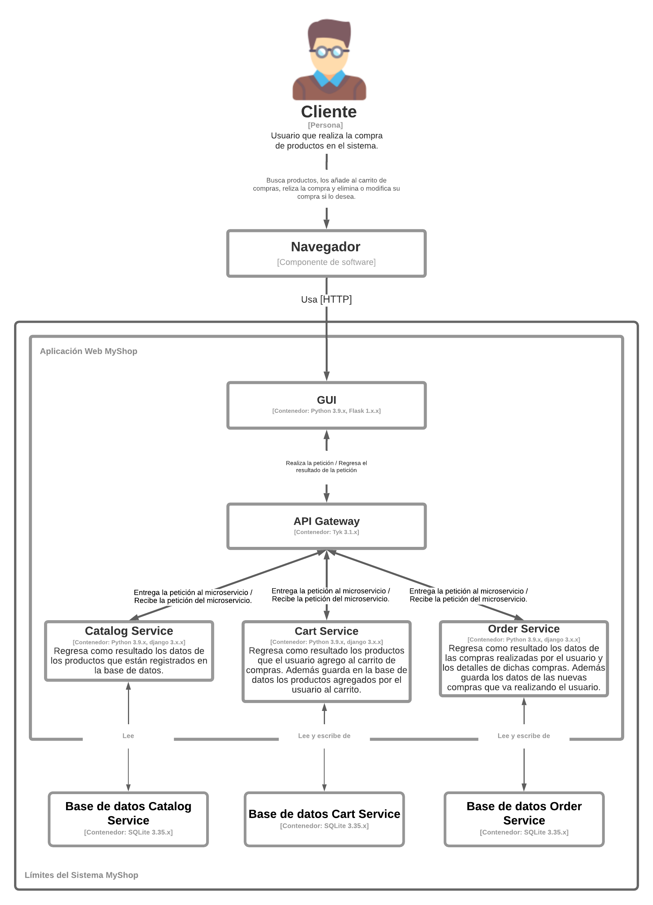

# MyShop

## Estructura del proyecto

- docs: Directorio que almacena documentos auxiliares para este archivo.
- ejemplo_microservicios: Directorio que almacena el código fuente del sistema.


## Sistema de MyShop

La estructura del sistema está compuesta por 3 microservicios, los cuales están desarrollados con el framework Django. Además, el sistema cuenta con una interfaz de usuario basada en las tareas anteriores, de un sistema de venta de productos.

A continuación se muestra una vista estática del diseño del sistema:



## Prerrequisitos

- Clonar el repositorio:
   ```shell
   $ git clone https://github.com/juanca1499/MyShop_microservicios_tarea3

   $ cd MyShop_microservicios_tarea3

   ```

- Instalamos Docker. La manera recomendada para implementar este sistema es utilizando [Docker](https://www.docker.com/), para instalarlo puedes seguir las instrucciones para cada sistema operativo haciendo clic [aquí](https://docs.docker.com/install/). Antes de continuar con los siguientes comandos es necesario tomar en cuenta que las pruebas se realizaron bajo la versión 20.10.5 de Docker.

- Una vez instalado docker debemos ejecutar los siguientes comandos en la consola para que se descarguen las imágenes necesarias (verificar que el servicio de Docker se encuentra corriendo):

   ```shell
   $ docker pull redis:6

   $ docker pull tykio/tyk-gateway:v3.1.2

   ```

   En Linux:

   ```shell
   $ sudo docker pull redis:6

   $ sudo docker pull tykio/tyk-gateway:v3.1.2

   ```


## Despliegue del sistema MyShop

Se deben correr los siguientes comandos en la carpeta raíz del proyecto.


### Creación de la red interna de docker

   ```shell
   $ docker network create --subnet=172.15.0.0/16 --attachable tyk
   ```

   En Linux:

   ```shell
   $ sudo docker network create --subnet=172.15.0.0/16 --attachable tyk
   ```

   Nota: En caso de que ocurra un error relacionado con una superposición de direcciones, favor de revisar la sección de [Problemas frecuentes](#problemas-frecuentes).


### Ejecución del contenedor de redis

   ```shell
   $ docker run -d --name tyk_redis --network tyk --ip 172.15.0.2 redis:6
   ```

   En Linux:

   ```shell
   $ sudo docker run -d --name tyk_redis --network tyk --ip 172.15.0.2 redis:6
   ```


### Ejecución del contenedor de tyk

   En Windows:
    
   Para el siguiente comando es necesario sustituir la cadena '$(pwd)' por el path del directorio actual (directorio raíz del proyecto).

   ```shell
   $ docker run -d --name tyk_gateway --network tyk --ip 172.15.0.3 -p 8080:8080 -v "$(pwd)/ejemplo_microservicios/tyk-gateway/tyk.standalone.conf:/opt/tyk-gateway/tyk.conf" -v "$(pwd)/ejemplo_microservicios/tyk-gateway/apps:/opt/tyk-gateway/apps" tykio/tyk-gateway:v3.1.2
   ```

   En Linux:

   ```shell
   $ sudo docker run -d --name tyk_gateway --network tyk --ip 172.15.0.3 -p 8080:8080 -v "$(pwd)/ejemplo_microservicios/tyk-gateway/tyk.standalone.conf:/opt/tyk-gateway/tyk.conf" -v "$(pwd)/ejemplo_microservicios/tyk-gateway/apps:/opt/tyk-gateway/apps" tykio/tyk-gateway:v3.1.2
   ```


### Construcción y ejecución de los microservicios

- Para construir y ejecutar cada uno de los microservicios se deberán realizar los siguientes pasos:

1. Ingresamos a la carpeta que contiene el código fuente del sistema:

   ```shell
   $ cd ejemplo_microservicios
   ```

A partir de este directorio deberemos acceder a la carpeta de cada microservicio para realizar la construcción.


#### Construcción y ejecución del microservicio catálogo.

   ```shell
   $ cd catalog_service

   $ docker build -t api-catalog:1.0 .

   $ docker run -d --name api-catalog --network tyk --ip 172.15.0.4 api-catalog:1.0
   
   $ cd ..
   ```

   En Linux:

   ```shell
   $ cd catalog_service

   $ sudo docker build -t api-catalog:1.0 .

   $ sudo docker run -d --name api-catalog --network tyk --ip 172.15.0.4 api-catalog:1.0
   
   $ cd ..
   ```


#### Construcción y ejecución del microservicio carrito

   ```shell
   $ cd cart_service

   $ docker build -t api-cart:1.0 .

   $ docker run -d --name api-cart --network tyk --ip 172.15.0.5 api-cart:1.0

   $ cd ..
   ```

   En Linux:

   ```shell
   $ cd cart_service

   $ sudo docker build -t api-cart:1.0 .

   $ sudo docker run -d --name api-cart --network tyk --ip 172.15.0.5 api-cart:1.0
   
   $ cd ..
   ```

#### Construcción y ejecución del microservicio ordenes

   ```shell
   $ cd orders_service

   $ docker build -t api-orders:1.0 .

   $ docker run -d --name api-orders --network tyk --ip 172.15.0.6 api-orders:1.0

   $ cd ..
   ```

   En Linux:

   ```shell
   $ cd orders_service

   $ sudo docker build -t api-orders:1.0 .

   $ sudo docker run -d --name api-orders --network tyk --ip 172.15.0.6 api-orders:1.0
   
   $ cd ..
   ```


### Construcción y ejecución de la GUI

- Antes de construir el contenedor de la interfaz de usuario para probar los microservicios será necesario obtener las llaves de acceso para cada microservicio a través del API Gateway y sustituirlas en el código de la GUI. 


#### Creación de las llaves para el API Gateway

- Para crear las llaves es necesario realizar peticiones tipo POST al servicio de tyk que descargamos anteriormente y que debe estar corriendo en un contenedor de Docker. Cada petición regresará como resultado la información de la llave creada, de la información obtenida lo que nos interesa es el valor de key, el cual debemos guardar pues lo utilizaremos más adelante.

- Las peticiones pueden ser realizadas por medio de alguna herramienta como Postman la cual podemos descargar [aquí](https://www.postman.com/downloads/) o se puede realizar desde consola utilizando la herramienta curl, la cual se explica en esta [sección](#creación-de-llaves-por-medio-de-curl).

   Nota: Para la creación de las llaves se utiliza 'localhost' en los comandos y en Postman debido a que se probó en la misma máquina. Si se está utilizando una máquina virtual o se está trabajando con dos máquinas al mismo tiempo, se debe cambiar el 'localhost' según corresponda.

    
##### Creación de llaves por medio de Postman
    
- Si decidimos utilizar Postman, después de descargar e instalar la herramienta, es necesario seguir los siguientes pasos:

    1. De la lista de tipos de peticiones que se encuentra en la parte superior izquierda de la herramienta Postman, seleccionamos POST.

    2. Al lado derecho de esta lista colocamos la url del servicio tyk:

        > http://localhost:8080/tyk/keys

    3. Damos click en la opción 'Headers' e ingresamos la información que se muestra en la siguiente imagen:

    <p align="center">
        
    </p>

    Nota: Sustituimos la cadena 'tyk-authorization' por la siguiente cadena: 352d20ee67be67f6340b4c0605b044b7.

    Esta información será utilizada para las peticiones de las 3 llaves que se crearán, la información que cambiará será la de la sección de 'Body' como se muestra a continuación.

    4. Para el primer microservicio catalogo, en la sección de 'Body' añadiremos la siguiente información en formato JSON como se muestra en la imagen:

    <p align="center">
        
    </p>

    ```shell
    {
        "rate": 1000,
        "per": 1,
        "expires": 0,
        "quota_max": -1,
        "quota_renews": 1458667309,
        "quota_remaining": -1,
        "quota_renewal_rate": 60,
        "access_rights": {
            "2": {
                "api_id": "2",
                "api_name": "Catalog API"
            }
        }
    }
    ```

    Damos click en el botón 'Send' y si todo funciona de forma correcta, debemos ver algo como lo que se muestra en la imagen:

    <p align="center">
        
    </p>

    Debemos guardar el valor de 'key' pues será utilizado en el código de la GUI para acceder al microservicio.

    5. Para el segundo microservicio carrito realizaremos los mismos pasos. En la sección de 'Body' añadiremos la siguiente información en formato JSON como se muestra en la imagen:

    <p align="center">
        
    </p>

    ```shell
    {
        "rate": 1000,
        "per": 1,
        "expires": 0,
        "quota_max": -1,
        "quota_renews": 1458667309,
        "quota_remaining": -1,
        "quota_renewal_rate": 60,
        "access_rights": {
            "3": {
                "api_id": "3",
                "api_name": "Cart API"
            }
        }
    }
    ```

    Damos click en el botón 'Send' y si todo funciona de forma correcta, debemos ver algo como lo que se muestra en la imagen:

    <p align="center">
        
    </p>

    Debemos guardar el valor de 'key' pues será utilizado en el código de la GUI para acceder al microservicio.


    6. Para el tercer microservicio ordenes realizaremos los mismos pasos. En la sección de 'Body' añadiremos la siguiente información en formato JSON como se muestra en la imagen:

    <p align="center">
        
    </p>

    ```shell
    {
        "rate": 1000,
        "per": 1,
        "expires": 0,
        "quota_max": -1,
        "quota_renews": 1458667309,
        "quota_remaining": -1,
        "quota_renewal_rate": 60,
        "access_rights": {
            "4": {
                "api_id": "4",
                "api_name": "Orders API"
            }
        }
    }
    ```

    Damos click en el botón 'Send' y si todo funciona de forma correcta, debemos ver algo como lo que se muestra en la imagen:

    <p align="center">
        
    </p>

    Debemos guardar el valor de 'key' pues será utilizado en el código de la GUI para acceder al microservicio.


##### Creación de llaves por medio de Curl

- También es posible generar las llaves desde la consola, haciendo uso de curl. Para poder utilizarlo es necesario instalar el programa en nuestra computadora.


En Windows:

El enlace a la página oficial para descargar curl es el siguiente:

> https://curl.se/download.html

En el siguiente enlace se encuentra una explicación detallada sobre cómo podemos instalar y utilizar con éxito curl en nuestra computadora con sistema operativo Windows.

> https://develop.zendesk.com/hc/en-us/articles/360001068567-Installing-and-using-cURL


En Linux:

Muchas distribuciones de Linux por defecto tienen instalado curl, si no es el caso lo podemos instalar con el siguiente comando:

```shell
$ sudo apt-get install curl
```

Para la creación de las llaver en Linux, simplemente se copian los siguientes comandos y se pegan en la consola.


- Ya que tenemos curl instalado, ejecutamos los siguientes comandos:

```shell
$ curl --request POST \
  --url http://localhost:8080/tyk/keys \
  --header 'Content-Type: application/json' \
  --header 'x-tyk-authorization: 352d20ee67be67f6340b4c0605b044b7' \
  --data '{
        "rate": 1000,
        "per": 1,
        "expires": 0,
        "quota_max": -1,
        "quota_renews": 1458667309,
        "quota_remaining": -1,
        "quota_renewal_rate": 60,
        "access_rights": {
            "2": {
                "api_id": "2",
                "api_name": "Catalog API"
            }
        }
    }'
```

```shell
$ curl --request POST \
  --url http://localhost:8080/tyk/keys \
  --header 'Content-Type: application/json' \
  --header 'x-tyk-authorization: 352d20ee67be67f6340b4c0605b044b7' \
  --data '{
        "rate": 1000,
        "per": 1,
        "expires": 0,
        "quota_max": -1,
        "quota_renews": 1458667309,
        "quota_remaining": -1,
        "quota_renewal_rate": 60,
        "access_rights": {
            "3": {
                "api_id": "3",
                "api_name": "Cart API"
            }
        }
    }'
```

```shell
$ curl --request POST \
  --url http://localhost:8080/tyk/keys \
  --header 'Content-Type: application/json' \
  --header 'x-tyk-authorization: 352d20ee67be67f6340b4c0605b044b7' \
  --data '{
        "rate": 1000,
        "per": 1,
        "expires": 0,
        "quota_max": -1,
        "quota_renews": 1458667309,
        "quota_remaining": -1,
        "quota_renewal_rate": 60,
        "access_rights": {
            "4": {
                "api_id": "4",
                "api_name": "Orders API"
            }
        }
    }'
```

- Si se ejecutaron con éxito, de cada comando se obtuvo una salida como la que se muestra en la siguiente imagen:

    <p align="center">
        
    </p>

    Es importante recordar que debemos guardar el valor de 'key' pues será utilizado en el código de la GUI para acceder a cada microservicio.


- Una vez que tengamos la llave para cada uno de los microservicios procederemos a sustituirlas en el archivo [ejemplo_microservicios/gui/gui.py](ejemplo_microservicios/gui/gui.py) de la siguiente manera:

    1. En la línea número 33, remover el texto <catalog_key> y reemplazarlo por la llave generada para la Catalog API.

    2. En la línea número 36, remover el texto <cart_key> y reemplazarlo por la llave generada para la Cart API.

    3. En la línea número 39, remover el texto <order_key> y reemplazarlo por la llave generada para la Orders API.


- Es importante verificar la versión de Docker con la que se está trabajando, las pruebas a este sistema se realizaron con la versión 20.10.5. Para verificar la versión de Docker, ejecutamos el siguiente comando en consola:

    ```shell
    $ docker version
    ```

    En Linux:

    ```shell
    $ sudo docker version
    ```

- Si la versión de Docker que se está utilizando es menor a la versión 20 o se está utilizando el sistema operativo Linux, es necesario realizar lo siguiente:

    En Windows:

    1. En las líneas 48, 50 y 52 vamos a sustituir la cadena host.docker.internal por 127.0.0.1.

    En Linux:

    1. En las líneas 48, 50 y 52 vamos a sustituir la cadena host.docker.internal por 172.17.0.1.


#### Construcción del contenedor de la GUI

- Ahora es momento de construir el contenedor de la GUI, para lograrlo ejecutamos los siguientes comandos desde el directorio 'ejemplo_microservicios':

   ```shell
   $ cd gui

   $ docker build -t gui:1.0 .
   ```

   En Linux:

   ```shell
   $ cd gui

   $ sudo docker build -t gui:1.0 .
   ```

#### Ejecución del contenedor de la GUI

- Para levantar el contenedor de la GUI ejecutamos el siguiente comando:

   ```shell
   $ docker run -d --name gui -p 5000:5000 gui:1.0
   ```

   En Linux:

   ```shell
   $ sudo docker run -d --name gui -p 5000:5000 gui:1.0
   ```

- Si todo se ejecutó con éxito podemos corroborar que nuestros contenedores se encuentran corriendo ejecutando el siguiente comando:

    ```shell
    $ docker ps
    ```

    En Linux:

    ```shell
    $ sudo docker ps
    ```

    Este comando nos mostrará los contenedores que se encuentran corriendo, en la columna Status, debemos observar la palabra UP en los contenedores gui, api-catalog, api-cart, api-orders, redis y tykio/tyk-gateway.

- Ya que confirmamos que nuestros contenedores se encuentran corriendo podremos ingresar a nuestro navegador y verificar que el sistema de ejemplo para probar los microservicios se encuentra funcionando correctamente, ingresamos a la siguiente url: 

> http://localhost:5000/

    Nota: Si se está utilizando una máquina virtual a través de Vagrant, se deberá sustituir el host 'localhost' por la IP privada utilizada para la máquina virtual.

- Si todo funcionó correctamente debemos poder ver la siguiente interfaz, en donde podremos probar el funcionamiento de los microservicios:

    <p align="center">
        
    </p>


## Comandos Docker

- Para corroborar que nuestros contenedores se encuentran corriendo podemos ejecutar el siguiente comando:

    ```shell
    $ docker ps
    ```

    En Linux:

    ```shell
    $ sudo docker ps
    ```

    Este comando nos mostrará los contenedores que se encuentran corriendo, en la columna Status, debemos observar la palabra UP en el contenedor. 

- Cada vez que realicemos cambios en nuestra aplicación se recomienda reiniciar el contenedor; para esto podemos utilizar el siguiente comando:

    ```shell
    $ docker restart <container_name>
    ```

    En Linux:

    ```shell
    $ sudo docker restart <container_name>
    ```

- Finalmente, si deseamos detener alguno de nuestros contenedores, ejecutamos el siguiente comando:

    ```shell
    $  docker stop <container_name>
    ```

    En Linux:

    ```shell
    $  sudo docker stop <container_name>
    ```


## Problemas frecuentes

### Superposición de direcciones

- En caso de que ocurra un error relacionado con una superposición de direcciones, es decir que la IP indicada para la subred ya se encuentre en uso, deberemos realizar lo siguiente:
   
    1. La IP utilizada en el comando de creación de la subred deberá ser modificada. Se sugiere cambiar solo el segundo octeto de la IP para solucionar el posible error. Por ejemplo en lugar de utilizar '--subnet=172.15.0.0/16' en el comando, podemos utilizar '--subnet=172.16.0.0/16'.

    2. Es importante tener en cuenta que en caso de haber cambiado la IP de la subred, será necesario aplicar este mismo cambio en todos los comandos en donde se utilice la IP de la subred. Para esto se debe modificar el segundo octeto de la IP de cada comando por el segundo octeto de la IP seleccionada, esto con el objetivo de que los comandos funcionen de manera correcta.

    3. Modificar la línea número 11 en donde se encuentra la IP del host del archivo [tyk.standalone.conf](ejemplo_microservicios/tyk-gateway/tyk.standalone.conf). Es decir, modificar el segundo octeto de la IP por el segundo octeto de la IP seleccionada. Esto se deberá realizar antes de ejecutar este [paso](#ejecución-del-contenedor-de-tyk).

    4. Realizar la misma modificación en la línea 28 del archivo [app.dart](ejemplo_microservicios/cart_service/hello_dart/app.dart). Es decir, modificar el segundo octeto de la IP por el segundo octeto de la IP seleccionada. Esto se deberá realizar antes de ejecutar este [paso](#construcción-y-ejecución-del-microservicio-2).

    5. Modificar el segundo octeto de la IP en la línea 29 de los archivos [api_dart.json](/ejemplo_microservicios/tyk-gateway/apps/api_dart.json), [api_django.json](/ejemplo_microservicios/tyk-gateway/apps/api_django.json) y [api_python](/ejemplo_microservicios/tyk-gateway/apps/api_python.json).json por el segundo octeto de la IP seleccionada. Estos archivos se encuentran en la ruta /ejemplo_microservicios/tyk-gateway/apps. Esta acción deberá realizarse antes de crear las llaves, es decir antes de realizar este [paso](#creación-de-las-llaves-para-el-api-gateway).
 

## Versión

2.0.0 - Mayo 2021

## Autores

* **Perla Velasco**
* **Jorge Alfonso Solís**
* **Alejandro Carrillo Villegas**
* **César Gabriel Díaz Curiel**
* **Juan Carlos García Murillo**
* **Josué Guillermo González Pinedo**
* **José Germán González Rodarte**